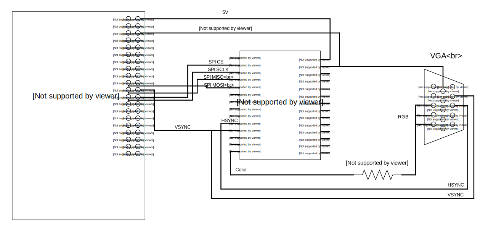
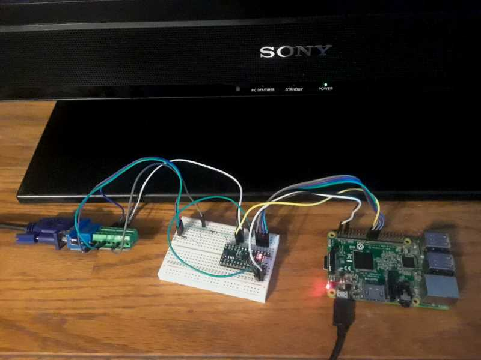

# Overview

ToyGPU is an implementation of a simple GPU with line drawing support
on a TinyFPGA BX.  Code to drive the GPU from a Raspberry Pi is included.

ToyGPU accepts a list of lines to draw over an SPI bus connection.
It is capable of drawing 1024 lines at 60 Hz with 640x480 resolution, 
transmitting the resulting image to a display via an analog VGA connection.

Since the TinyFPGA BX lacks enough RAM for a full framebuffer, each scanline
is rasterized just prior to display and then discarded to make space for 
the following scanlines.  At no time is a full rendered image in memory.

A recording of TinyGPU rendering a model is
[available on YouTube](https://www.youtube.com/watch?v=6QwtuARxwdo).

#  Setup

To get started with ToyGPU, you'll need a TinyFPGA BX, a Raspberry Pi
and a VGA connector.  Wire the connections as seen in the included
schematic:

Mine looks like this:

Install `apio` and associated tools as described by
[the instructions at tinyfpga.com](https://tinyfpga.com/bx/guide.html).
You can then build the fpga binary with `apio build` in the `fgpa/`
subdirectory.  Program the FPGA with it using `tinyprog -p hardware.bin`.

Install Raspbian Stretch on your Raspberry Pi.  You'll need to modify
the kernel parameters in `/boot/cmdline.txt` to add 
`spidev.bufsize=65536`.  The default max SPI transmission under Linux
is 4096 bytes, but we need more than that.  You'll also need to 
install the following packages: `python2.7 cython pigpio python-rpi.gpio`.
Now build the Cython extension in the `rpi/` subdirectory using the 
`build.sh` script.

If everything has been wired up correctly and installed, you can render
a model on-screen.  Ensure the `pigpio` daemon is running with `sudo pigpiod`
and then run the `monkey.py` script in the `rpi/` subdirectory with
`sudo python monkey.py`.  You should see Suzanne, the monkey from Blender,
rotating on your display.
